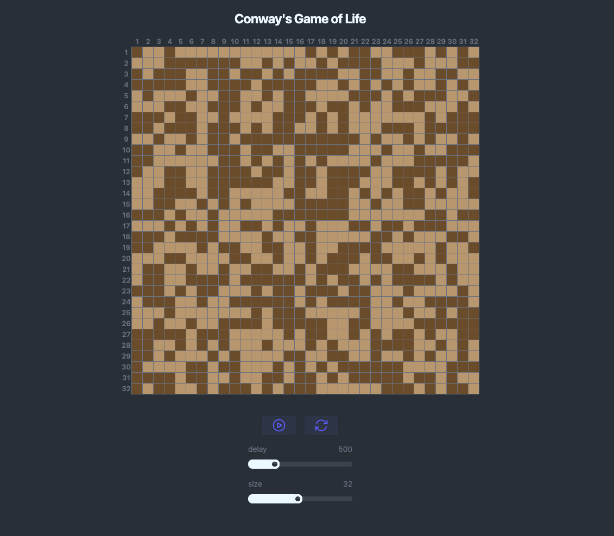
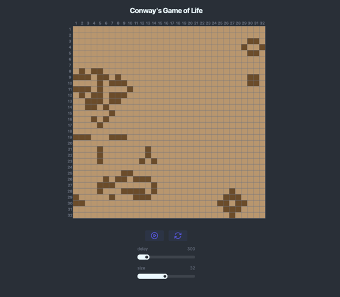

# Conway's GameOfLife Simultation with LiveView

To start your Phoenix server:

* Run `mix setup` to install and setup dependencies
* Start Phoenix endpoint with `mix phx.server` or inside IEx with `iex -S mix phx.server`

Now you can visit [`localhost:4000`](http://localhost:4000) from your browser.

Ready to run in production? Please [check our deployment guides](https://phoenix.hexdocs.pm/deployment.html).

A simple implementation of Conway's Game Of Life with LiveView UI.

## Features
    - Chessboard like front-end with color annotations for living/dead cells
    - Dynamic board size 
    - Dynamic delay of board updates
    - Toggle pixel feature
    - Start/Reset Buttons

## Samples

  

  

## TODOs

### Features to be added later
    - Statistics
    - Patterns
    - Variations
    - Modes

## Learn more

* Official website: https://www.phoenixframework.org/
* Guides: https://phoenix.hexdocs.pm/overview.html
* Docs: https://phoenix.hexdocs.pm
* Forum: https://elixirforum.com/c/phoenix-forum
* Source: https://github.com/phoenixframework/phoenix
